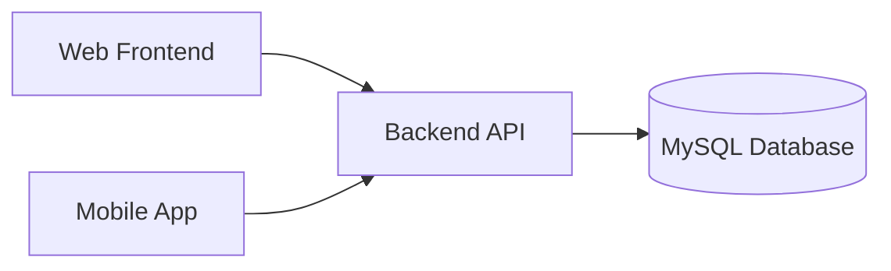

# PraPdBL General Documentation

## Project Title
PraPdBL

## Description
PraPdBL is a campus room booking system that supports room discovery, booking requests, and approval workflows. The system consists of a backend API, a web frontend, and a mobile app, backed by a relational database.

## Features
- Room listing and availability checks
- Room booking requests with time windows
- Booking approval or rejection by admins
- Booking status history for audit trail
- User management and role-based access

## High-Level Flow
1. User accesses the web or mobile client.
2. Client requests available rooms from the backend API.
3. User submits a booking request.
4. Admin reviews and approves or rejects the request.
5. Backend updates booking status and history.
6. Client shows the latest booking status to the user.

## System Architecture (Logical View)

## Tech Stack
### Backend
- .NET 9 (ASP.NET Core Web API)
- Entity Framework Core 9
- Pomelo.EntityFrameworkCore.MySql
- OpenAPI/Swagger

### Frontend
- React 19
- TypeScript 5.9
- Vite 7
- MUI (Material UI)
- React Router

### Mobile
- Flutter
- Dart 3.11
- HTTP client (http package)

### Database
- MySQL

### Infrastructure & Tools
- EF Core migrations
- ESLint
- Vite dev server
- Flutter SDK

## Installation
### Prerequisites
- .NET SDK 9
- Node.js (latest LTS recommended)
- Flutter SDK (Dart 3.11)
- MySQL server

### Backend
1. Open the backend folder: `PraPdBL-Backend`
2. Restore dependencies: `dotnet restore`
3. Update connection string in `appsettings.json`
4. Run the API: `dotnet run`

### Frontend
1. Open the frontend folder: `PraPdBL-Frontend`
2. Install dependencies: `npm install`
3. Start dev server: `npm run dev`

### Mobile
1. Open the mobile folder: `PraPdBL-Mobile`
2. Fetch dependencies: `flutter pub get`
3. Run the app: `flutter run`

## Usage
- Web app: open the Vite dev server URL shown in the terminal
- API: access OpenAPI at `/openapi` in development
- Mobile: run on emulator or device via Flutter

## Environment Variables
PraPdBL uses configuration files for environment-specific settings.

### Backend (`appsettings.json`)
- `ConnectionStrings:DefaultConnection`
- `Cors:AllowedOrigins`

### Frontend (`.env` if needed)
- `VITE_API_BASE_URL` (example: `http://localhost:5000`)

### Mobile (`.env` or config file if used)
- API base URL for the backend service

## Contributing
See [CONTRIBUTING.md](CONTRIBUTING.md) for contribution steps and workflow rules.

## License
TBD

## Related Documentation
- API documentation: [api-documentation.md](api-documentation.md)
- ERD and table relationships: [erd.md](erd.md)
- Repository structure and Git workflow: [git-workflow.md](git-workflow.md)
- Contribution guide: [CONTRIBUTING.md](CONTRIBUTING.md)
