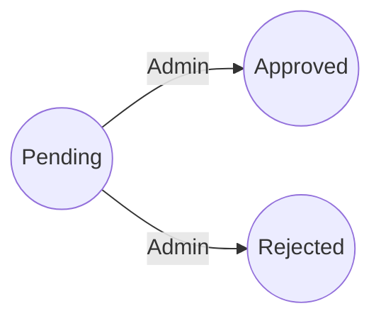

# API Documentation - Room Booking System

## Overview
This document describes the backend API endpoints and business flow for the room booking system. It is intended for frontend, mobile, and third-party integrators who need a clear, human-readable guide.

- Base path: `/api`
- Content type: `application/json`
- Time fields use ISO 8601 (e.g., `2026-02-13T08:30:00`)

## Authentication & Roles
The backend is configured for JWT-based authentication, but the controllers do not enforce `[Authorize]` attributes yet. The only enforced role check is for booking status changes:

- Status transitions require `ChangedBy` to be a user with role `ADMIN`.

## Status Dictionary
Booking statuses are seeded and must match these IDs:

| Id | Code     | Label    |
|----|----------|----------|
| 1  | PENDING  | Pending  |
| 2  | APPROVED | Approved |
| 3  | REJECTED | Rejected |

## Common Response Shape
List endpoints return a paged response:

```json
{
  "total": 100,
  "page": 1,
  "pageSize": 10,
  "data": [
    { }
  ]
}
```

## Endpoints

### Rooms

#### Create Room
- **Method**: `POST`
- **URL**: `/api/rooms`
- **Purpose**: Create a room.
- **Body**:

```json
{
  "roomCode": "R-101",
  "roomName": "Meeting Room 101",
  "capacity": 12,
  "location": "Floor 1",
  "isActive": true
}
```

- **Success (201)**: Returns the created room.
- **Errors**:
  - `400` invalid payload
  - `409` room code already used

#### List Rooms
- **Method**: `GET`
- **URL**: `/api/rooms?page=1&pageSize=10`
- **Purpose**: List rooms with current booking status (if any).
- **Query**:
  - `page` (default `1`)
  - `pageSize` (default `10`)
- **Success (200)**: `PagedResponse<RoomListItem>`

Room list item shape:

```json
{
  "id": 1,
  "roomCode": "R-101",
  "roomName": "Meeting Room 101",
  "capacity": 12,
  "location": "Floor 1",
  "isActive": true,
  "bookingStatus": "Pending"
}
```

#### Get Room Detail
- **Method**: `GET`
- **URL**: `/api/rooms/{id}`
- **Purpose**: Get room by id.
- **Success (200)**: Room entity
- **Errors**:
  - `404` room not found

#### Update Room
- **Method**: `PUT`
- **URL**: `/api/rooms/{id}`
- **Purpose**: Update room fields.
- **Body**: Same as create.
- **Success (200)**: Updated room entity
- **Errors**:
  - `400` invalid payload
  - `404` room not found
  - `409` room code already used

#### Delete Room (Soft Delete)
- **Method**: `DELETE`
- **URL**: `/api/rooms/{id}`
- **Purpose**: Soft delete a room.
- **Success (204)**
- **Errors**:
  - `404` room not found

#### Restore Room
- **Method**: `PUT`
- **URL**: `/api/rooms/{id}/restore`
- **Purpose**: Restore a soft-deleted room.
- **Success (200)**
- **Errors**:
  - `404` room not found
  - `409` room code already used by another active room

---

### Users

#### Create User
- **Method**: `POST`
- **URL**: `/api/users`
- **Purpose**: Create a user.
- **Body**:

```json
{
  "name": "Jane Doe",
  "email": "jane@example.com",
  "role": "ADMIN"
}
```

- **Success (201)**: Returns created user.
- **Errors**:
  - `400` invalid payload
  - `409` email already used

#### List Users
- **Method**: `GET`
- **URL**: `/api/users?page=1&pageSize=10`
- **Purpose**: List users.
- **Query**:
  - `page` (default `1`)
  - `pageSize` (default `10`)
- **Success (200)**: `PagedResponse<User>`

#### Get User Detail
- **Method**: `GET`
- **URL**: `/api/users/{id}`
- **Purpose**: Get user by id.
- **Success (200)**: User entity
- **Errors**:
  - `404` user not found

#### Update User
- **Method**: `PUT`
- **URL**: `/api/users/{id}`
- **Purpose**: Update user fields.
- **Body**: Same as create.
- **Success (200)**: Updated user entity
- **Errors**:
  - `400` invalid payload
  - `404` user not found
  - `409` email already used

#### Delete User (Soft Delete)
- **Method**: `DELETE`
- **URL**: `/api/users/{id}`
- **Purpose**: Soft delete a user.
- **Success (204)**
- **Errors**:
  - `404` user not found

#### Restore User
- **Method**: `PUT`
- **URL**: `/api/users/{id}/restore`
- **Purpose**: Restore a soft-deleted user.
- **Success (200)**
- **Errors**:
  - `404` user not found
  - `409` email already used by another active user

---

### Bookings

#### Create Booking
- **Method**: `POST`
- **URL**: `/api/bookings`
- **Purpose**: Create a booking. Status starts as `Pending`.
- **Body**:

```json
{
  "roomId": 1,
  "userId": 12,
  "purpose": "Weekly sync",
  "startTime": "2026-02-20T09:00:00",
  "endTime": "2026-02-20T10:00:00"
}
```

- **Success (201)**: Booking entity
- **Errors**:
  - `400` invalid payload (including overlapping time range)

#### List Bookings
- **Method**: `GET`
- **URL**: `/api/bookings?page=1&pageSize=10`
- **Purpose**: List bookings with room, user, and status included.
- **Query**:
  - `page` (default `1`)
  - `pageSize` (default `10`)
- **Success (200)**: `PagedResponse<Booking>`

#### Get Booking Detail
- **Method**: `GET`
- **URL**: `/api/bookings/{id}`
- **Purpose**: Get booking by id.
- **Success (200)**: Booking entity (includes room, user, status)
- **Errors**:
  - `404` booking not found

#### Update Booking
- **Method**: `PUT`
- **URL**: `/api/bookings/{id}`
- **Purpose**: Update booking details (does not change status).
- **Body**: Same as create.
- **Success (200)**: Updated booking
- **Errors**:
  - `400` invalid payload (including overlapping time range)
  - `404` booking not found

#### Update Booking Status
- **Method**: `PUT`
- **URL**: `/api/bookings/{id}/status`
- **Purpose**: Change booking status. Only ADMIN users can perform this action.
- **Body**:

```json
{
  "statusId": 2,
  "changedBy": 1,
  "note": "Approved by admin"
}
```

- **Success (200)**: Updated booking with current status
- **Errors**:
  - `400` invalid payload or status id not found
  - `403` only admin can change status
  - `404` booking not found

#### Booking Status History
- **Method**: `GET`
- **URL**: `/api/bookings/history`
- **Purpose**: Get status transition history for all bookings.
- **Success (200)**: Array of status history entries

History entry shape:

```json
{
  "id": 1,
  "bookingId": 10,
  "oldStatusId": 1,
  "oldStatusLabel": "Pending",
  "newStatusId": 2,
  "newStatusLabel": "Approved",
  "changedById": 1,
  "changedByName": "Admin User",
  "changedAt": "2026-02-13T08:30:00",
  "note": "Approved",
  "room": {
    "id": 3,
    "code": "R-101",
    "name": "Meeting Room 101"
  },
  "user": {
    "id": 12,
    "name": "Jane Doe"
  }
}
```

#### Delete Booking (Soft Delete)
- **Method**: `DELETE`
- **URL**: `/api/bookings/{id}`
- **Purpose**: Soft delete a booking.
- **Success (204)**
- **Errors**:
  - `404` booking not found

## Booking Flow

1. **Create booking** via `POST /api/bookings`.
2. **Initial status** is `Pending` (status id `1`).
3. **Admin updates status** via `PUT /api/bookings/{id}/status` to `Approved` or `Rejected`.
4. **Clients retrieve data** using:
   - `GET /api/bookings` for list
   - `GET /api/bookings/{id}` for detail
   - `GET /api/bookings/history` for status transitions

## Status Flow Diagram



## Notes
- For booking creation and update, the backend validates time overlaps per room.
- `DeletedAt` fields indicate soft deletes; deleted records are hidden from list endpoints.
