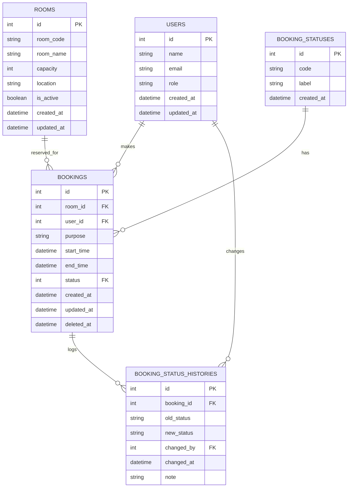

# 📊 ERD – Sistem Peminjaman Ruangan Kampus

Dokumen ini menjelaskan **Entity Relationship Diagram (ERD)** untuk sistem peminjaman ruangan kampus. ERD ini dirancang agar **mudah dikembangkan**, **jelas secara bisnis**, dan **siap untuk kebutuhan skala produksi**.

---

## 🧩 Gambaran Umum Sistem

Sistem ini memungkinkan:

* Pengguna (mahasiswa/dosen/staff) melakukan peminjaman ruangan
* Admin menyetujui atau menolak peminjaman
* Sistem menyimpan **riwayat status peminjaman** secara lengkap

Fokus utama desain:

* Normalisasi data
* Audit trail (riwayat perubahan status)
* Fleksibel untuk penambahan fitur di masa depan

---

## 🗂️ Entity Relationship Diagram (ERD)

---

## 📘 Penjelasan Tabel

### 1️⃣ users

Menyimpan data pengguna sistem, baik peminjam maupun pihak yang menyetujui peminjaman.

Kolom utama:

* `id` – Primary Key
* `name` – Nama pengguna
* `email` – Email unik pengguna
* `role` – Peran pengguna (USER / ADMIN)
* `created_at`, `updated_at` – Audit waktu

---

### 2️⃣ rooms

Data master ruangan kampus yang dapat dipinjam.

Kolom utama:

* `id` – Primary Key
* `room_code` – Kode ruangan (contoh: A101, Lab-2)
* `room_name` – Nama ruangan
* `capacity` – Kapasitas ruangan
* `location` – Lokasi gedung/lantai
* `is_active` – Status ketersediaan ruangan
* `created_at`, `updated_at`

---

### 3️⃣ bookings

Tabel inti yang menyimpan data peminjaman ruangan.

Kolom utama:

* `id` – Primary Key
* `room_id` – Relasi ke tabel `rooms`
* `user_id` – Relasi ke tabel `users`
* `purpose` – Keperluan peminjaman
* `start_time`, `end_time` – Waktu peminjaman
* `status` – Relasi ke `booking_statuses`
* `created_at`, `updated_at`
* `deleted_at` – Digunakan untuk soft delete (opsional)

---

### 4️⃣ booking_statuses

Tabel master untuk status peminjaman.

Digunakan agar sistem **mudah dikembangkan** (misal: `CANCELLED`, `EXPIRED`).

Kolom:

* `id` – Primary Key
* `code` – Kode status (PENDING, APPROVED, REJECTED)
* `label` – Nama status yang ditampilkan
* `created_at`

---

### 5️⃣ booking_status_histories

Menyimpan riwayat perubahan status peminjaman sebagai **audit trail**.

Kolom utama:

* `id` – Primary Key
* `booking_id` – Relasi ke `bookings`
* `old_status` – Status sebelumnya
* `new_status` – Status baru
* `changed_by` – User yang mengubah status
* `changed_at` – Waktu perubahan
* `note` – Catatan opsional

---

## ✅ Catatan Desain

* Relasi status dipisahkan ke tabel master untuk fleksibilitas
* Riwayat status memungkinkan tracking & audit
* Struktur siap dikembangkan untuk:

  * Multi-role approval
  * Notifikasi
  * Reporting

---

📌 **Dokumen ini ditujukan untuk kebutuhan dokumentasi teknis dan referensi pengembangan backend.**
