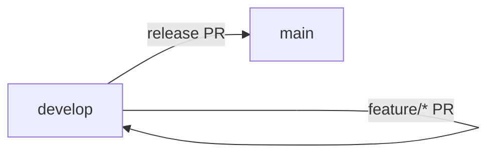

# Repository Structure and Git Workflow

## Purpose
This document defines the repository structure and Git workflow standards for PraPdBL so the team can collaborate consistently across backend, frontend, mobile, infrastructure, and documentation.

## Repository Structure
Each platform should live in its own repository.

| Repository | Responsibility | Stack |
| --- | --- | --- |
| backend | ASP.NET Core Web API | .NET, EF Core |
| frontend | Web client | React, TypeScript |
| mobile | Mobile client (future-ready) | Flutter |
| infrastructure | Deployment, CI/CD, IaC | Docker, Terraform, pipelines |
| docs | Technical and API documentation | Markdown |

## Branching Strategy
### Branch Types
- `main`: production-ready code
- `develop`: active development branch
- `feature/*`: feature or task-specific branches
- `chore/*`: maintenance or setup tasks (example: `chore/git-workflow-setup`)

### Rules
- All feature development branches from `develop`.
- Pull requests are required before merging to `develop` or `main`.
- Protect `main` and `develop` with required reviews and status checks.



## Commit Convention (Conventional Commits)
Use this format for every commit:

```
<type>(scope): <short summary>
```

### Types
- `feat`: new feature
- `fix`: bug fix
- `chore`: maintenance or setup
- `docs`: documentation
- `refactor`: code refactoring

### Examples
- `feat(booking): add room availability endpoint`
- `fix(auth): handle expired tokens`
- `chore(git): document workflow standards`
- `docs(api): update booking endpoints`
- `refactor(user): simplify role checks`

## Standard Workflow
1. Create a branch from `develop` (example: `feature/booking-validation`).
2. Commit changes using Conventional Commits.
3. Open a PR to `develop` and request review.
4. Merge to `develop` after checks pass.
5. Open a PR from `develop` to `main` for releases.

## Notes
- Consider commit linting and hooks (for example, Husky or lefthook) in the future.
- Align branch protection and checks with CI/CD pipelines when available.
